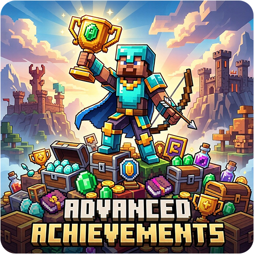

<p align="center">
  
</p>
<h1 align="center">Advanced Achievements Plugin</h1>
<p align="center">
  <b>A comprehensive achievement system for Minecraft servers.</b><br>
  <b>Custom rewards, progress tracking, and persistent database integration.</b>
</p>
<p align="center">
  <a href="https://github.com/Cobbleworks/Advanced-Achievements-Plugin/releases"></a>&nbsp;&nbsp;<a href="https://github.com/Cobbleworks/Advanced-Achievements-Plugin/blob/main/LICENSE"></a>&nbsp;&nbsp;&nbsp;&nbsp;&nbsp;&nbsp;&nbsp;&nbsp;&nbsp;&nbsp;<a href="https://github.com/Cobbleworks/Advanced-Achievements-Plugin/issues"></a>
</p>

Advanced Achievements is an open-source Minecraft plugin that provides a fully configurable achievement system for Spigot and Paper servers. The plugin ships with 30 predefined achievements out of the box and tracks player progress across 19 task types, including combat, building, smelting, movement, and playtime-based goals. Every achievement is independently configurable with its own title, description, GUI icon, task target, required count, reward list, hidden flag, and prerequisite chain. Progress and claim state are persisted per player in either SQLite or MySQL, and the entire system is designed to be extended by server developers through a built-in Java API.

### **Core Features**

- **30 Predefined Achievements:** Includes a full starter progression set with combat, utility, exploration, economy, and endgame milestone achievements
- **19 Task Types:** Tracks block break/place, item pickup/crafting/smelting, mob and player kills, damage dealt/taken, fishing, eating, enchanting, trading, mining, breeding, taming, death, walk distance, and play time with `ANY` and specific targets
- **Reward System:** Five reward types supported per achievement - items, XP, economy money (via Vault), server commands with `{player}` and `{uuid}` placeholders, and title messages - all defined directly in `achievements.yml`
- **Achievement Prerequisites:** Achievements can require other achievements to be unlocked first, enabling multi-step progression chains
- **Hidden Achievements:** Achievements can be flagged as hidden so they do not appear in the list or GUI until the player has already unlocked them
- **Interactive GUI:** An inventory-based achievement browser with paginated display, real-time progress bars, colour-coded states (locked/unlocked/claimed), and click-to-claim reward functionality
- **Chat Creation Wizard:** Administrators can create new achievements interactively through a guided step-by-step chat flow without editing any YAML manually
- **Database Integration:** Supports both SQLite (single-server) and MySQL (multi-server/network) with fully asynchronous load and save operations
- **Broadcast Notifications:** On unlock, players receive a title and chat notification; an optional server-wide broadcast message is configurable
- **Sound and Firework Effects:** Unlock events trigger a configurable sound and an optional firework display at the player's location
- **Progress Bar Display:** Optional ActionBar or BossBar progress display, configurable refresh interval and display trigger
- **Fully Customisable Messages:** All chat output, prefixes, GUI labels, and notification text are editable in `messages.yml`
- **Developer API:** A full Java API (`AchievementAPI`) is exposed for other plugins to create achievements, query progress, grant unlocks, and add progress programmatically

### **Supported Platforms**

- **Server Software:** `Spigot`, `Paper`, `Purpur`, `CraftBukkit`
- **Minecraft Versions:** `1.20` and higher
- **Java Requirements:** `Java 17+`
- **Optional Dependency:** `Vault` (required only for economy/money rewards)

## **Table of Contents**

1. [Getting Started](#getting-started)
    - [Prerequisites](#prerequisites)
    - [Installation Steps](#installation-steps)
    - [First Launch & Configuration](#first-launch--configuration)
    - [Verifying Installation](#verifying-installation)
2. [Configuration](#configuration)
    - [config.yml Reference](#configyml-reference)
    - [Achievement Definition Format](#achievement-definition-format)
    - [Task Types](#task-types)
    - [Reward Format](#reward-format)
3. [How It Works](#how-it-works)
    - [Task Tracking](#task-tracking)
    - [Progress and Unlock Flow](#progress-and-unlock-flow)
    - [Database Persistence](#database-persistence)
4. [Player Commands](#player-commands)
    - [Command Reference](#command-reference)
5. [Administrative Commands](#administrative-commands)
6. [Permissions](#permissions)
7. [Developer API](#developer-api)
8. [Building from Source](#building-from-source)
9. [License](#license)
10. [Screenshots](#screenshots)

## **Getting Started**

### **Prerequisites**

Before installing Advanced Achievements, confirm the following requirements are met:

- A Minecraft server running **Spigot**, **Paper**, **Purpur**, or any compatible fork
- Server version **1.20 or higher** (`api-version: 1.20` is the minimum)
- **Java 17** or newer installed on the machine running the server
- Operator or console access to install plugin files

**Optional:** If [Vault](https://www.spigotmc.org/resources/vault.34315/) and a compatible economy plugin are installed, the `MONEY:` reward type becomes available. All other reward types function without Vault.

### **Installation Steps**

1. Download the latest `AdvancedAchievements-x.x.x.jar` from the [Releases](https://github.com/Cobbleworks/Advanced-Achievements-Plugin/releases) page
2. *(Optional)* Download and install [Vault](https://www.spigotmc.org/resources/vault.34315/) if you want economy/money rewards
3. **Stop your server completely** before placing any files
4. Copy the `.jar` into your server's `plugins/` directory
5. Start the server - Advanced Achievements generates its configuration folder automatically on first boot

### **First Launch & Configuration**

On the first server start after installation, Advanced Achievements creates:

```
plugins/
└── AdvancedAchievements/
    ├── config.yml           - Global settings: database, notifications, GUI, progress bar
    ├── achievements.yml     - All achievement definitions
    └── messages.yml         - All plugin messages, prefixes, and GUI item names
```

- **`config.yml`** controls the database backend (SQLite or MySQL), notification sounds, firework effects, progress bar display, and GUI layout. See the [Configuration](#configuration) section for all keys.
- **`achievements.yml`** contains every achievement definition. Edit this file to add, modify, or remove achievements, then run `/ach reload` to apply changes without a restart.
- **`messages.yml`** contains all player-facing text, supporting `&` colour codes throughout.

### **Verifying Installation**

- Run `/plugins` in-game - `AdvancedAchievements` should appear green in the list
- Run `/version AdvancedAchievements` to confirm the installed version matches the release you downloaded
- Run `/ach` in-game to open the paginated achievement list
- Run `/ach gui` to verify the inventory GUI opens correctly
- If the plugin fails to load, check the server console for `AdvancedAchievements` error messages (common causes: wrong Java version, corrupt JAR, or a missing database driver)

## **Configuration**

### **config.yml Reference**

| Key | Default | Description |
|-----|---------|-------------|
| `database.type` | `SQLite` | Database backend: `SQLite` or `MySQL` |
| `database.sqlite.file` | `achievements.db` | SQLite file name relative to the plugin folder |
| `database.mysql.*` | - | MySQL host, port, database, username, password |
| `progress-bar.enabled` | `false` | Show a progress bar to players |
| `progress-bar.type` | `ACTIONBAR` | Display type: `ACTIONBAR` or `BOSSBAR` |
| `progress-bar.boss-bar.color` | `GREEN` | BossBar colour (used when type is `BOSSBAR`) |
| `progress-bar.boss-bar.style` | `SOLID` | BossBar style (e.g., `SOLID`, `SEGMENTED_6`) |
| `progress-bar.update-interval` | `20` | Update interval in ticks (20 ticks = 1 second) |
| `progress-bar.show-on-progress` | `false` | Only show bar when progress increases |
| `notifications.sound.enabled` | `true` | Play sound on achievement unlock |
| `notifications.sound.sound` | `ENTITY_PLAYER_LEVELUP` | Bukkit sound name |
| `notifications.sound.volume` | `1.0` | Sound volume |
| `notifications.sound.pitch` | `1.0` | Sound pitch |
| `notifications.title.enabled` | `true` | Show title/subtitle on achievement unlock |
| `notifications.title.fade-in` | `10` | Title fade-in duration in ticks |
| `notifications.title.stay` | `70` | Title stay duration in ticks |
| `notifications.title.fade-out` | `20` | Title fade-out duration in ticks |
| `notifications.chat.enabled` | `true` | Send chat message on unlock |
| `notifications.chat.broadcast` | `false` | Broadcast unlock to all online players |
| `notifications.firework.enabled` | `true` | Spawn a firework on achievement unlock |
| `gui.rows` | `6` | Number of inventory rows in the GUI (max 6) |
| `gui.items-per-page` | `45` | Achievements shown per GUI page |
| `gui.auto-refresh` | `true` | Automatically refresh the GUI for open players |
| `gui.refresh-interval` | `60` | GUI auto-refresh interval in seconds |
| `defaults.icon` | `PAPER` | Default icon material for new achievements |

### **Achievement Definition Format**

All achievements are defined under the `achievements:` key in `achievements.yml`. Each entry uses the following structure:

```yaml
achievements:
  <unique_id>:                         # lowercase ID using underscores (e.g., first_steps)
    title: "Display Title"             # shown in chat, GUI, and notifications
    description: "What the player must do"
    icon: COBBLESTONE                  # any valid Minecraft material name
    task:
      type: block_break                # one of the supported task type IDs (see Task Types below)
      target: "ANY"                    # material, entity, or ANY (see Task Types for details)
      amount: 10                       # required count to unlock the achievement
    rewards:                           # list of rewards granted on claim (see Reward Format)
      - "ITEM:BREAD:5"
      - "XP:100"
      - "MONEY:500"
    hidden: false                      # if true, hidden until unlocked by the player
    prerequisites:                     # list of achievement IDs that must be unlocked first
      - first_steps
```

Achievements added or edited in `achievements.yml` take effect immediately after `/ach reload`. Achievements can also be created interactively in-game using the `/ach create` wizard.

### **Task Types**

| Task Type ID | Tracks | Valid `target` Values |
|--------------|--------|-----------------------|
| `block_break` | Breaking blocks | `ANY`, or any block material (e.g., `OAK_LOG`, `STONE`) |
| `block_place` | Placing blocks | `ANY`, or any block material |
| `item_pickup` | Picking up items | `ANY`, `LOG` (all log/wood types), or any item material name |
| `mob_kill` | Killing entities | `ANY`, `HOSTILE` (any monster), or any entity type (e.g., `ZOMBIE`) |
| `player_kill` | Killing players | `ANY`, or specific player name |
| `item_craft` | Crafting items | `ANY`, or any craftable material name |
| `item_smelt` | Smelting output collection | `ANY`, or smelted output item material (e.g., `IRON_INGOT`) |
| `fishing` | Catching fish or items | `ANY`, or any caught item material name |
| `eating` | Consuming food | `ANY`, or any food material name |
| `enchanting` | Enchanting items | `ANY` (individual item target not tracked) |
| `trading` | Completing villager trades | `ANY` (individual item target not tracked) |
| `mining` | Mining ores | `ANY`, or any ore material name containing `_ORE` |
| `damage_dealt` | Dealing combat damage | `ANY`, or entity type name |
| `damage_taken` | Taking incoming damage | `ANY`, or damage cause (e.g., `FALL`, `LAVA`, `ENTITY_ATTACK`) |
| `walk_distance` | Travel distance | `ANY`, or world name (stored as centi-blocks) |
| `play_time` | Online play time | `ANY`, or world name (stored in seconds) |
| `breeding` | Breeding animals | `ANY`, or any breedable entity type (e.g., `COW`) |
| `taming` | Taming animals | `ANY`, or any tameable entity type (e.g., `WOLF`) |
| `death` | Dying | `ANY`, or a specific player name to track per-player deaths |

### **Reward Format**

Rewards are defined as strings in the `rewards` list of each achievement. Each reward uses the format `TYPE:VALUE` or `TYPE:VALUE:AMOUNT`:

| Format | Description | Example |
|--------|-------------|---------|
| `ITEM:<material>:<amount>` | Give the player an item | `ITEM:DIAMOND:5` |
| `XP:<amount>` | Give XP experience points | `XP:500` |
| `EXPERIENCE:<amount>` | Alias for XP | `EXPERIENCE:100` |
| `MONEY:<amount>` | Give economy money via Vault | `MONEY:1000` |
| `COMMAND:<command>` | Execute a console command | `COMMAND:give {player} golden_apple 1` |
| `TITLE:<text>` | Send a title message to the player | `TITLE:Master Crafter` |
| `<material>:<amount>` | Shorthand item reward | `BREAD:5` |

**Placeholders in `COMMAND` rewards:**
- `{player}` - replaced with the player's name
- `{uuid}` - replaced with the player's UUID

If the player's inventory is full, item rewards are dropped at the player's feet.

## **How It Works**

### **Task Tracking**

Task tracking runs through `AchievementListener`, which listens for 12 categories of Bukkit events. When a tracked event fires, the plugin reads the relevant material or entity type from the event, checks it against every loaded achievement's task definition, and calls `ProgressManager.addProgress()` for each matching achievement. Progress is accumulated per player and per achievement ID in memory and written to the database asynchronously.

### **Progress and Unlock Flow**

1. A player triggers a tracked action (e.g., breaks a block)
2. `AchievementListener` processes the event and calls `ProgressManager.addProgress()` for matching achievements
3. `ProgressManager` checks whether the player's new total meets or exceeds the achievement's `amount` requirement
4. If the threshold is reached, the achievement transitions to `UNLOCKED` state and `AchievementUnlockEvent` fires (cancellable)
5. If not cancelled, `RewardManager` queues all rewards for delivery and `MessageManager` sends the unlock notification (title, chat, optional broadcast, optional firework, optional sound)
6. The player can then open the GUI (`/ach gui`) to browse and click-claim any unclaimed unlocked achievements

Hidden achievements are not shown in the list or GUI until they reach `UNLOCKED` state. Achievement prerequisites are checked before any progress is accepted - if a prerequisite is not yet unlocked, progress toward the dependent achievement is silently skipped.

### **Database Persistence**

Advanced Achievements supports two database backends:

- **SQLite** (default): Stores all progress in a local `.db` file inside the plugin folder. No external setup required - ideal for single-server deployments.
- **MySQL**: Connects to an external MySQL database. All reads and writes run on the Bukkit async scheduler to avoid blocking the main thread. Set `database.type: MySQL` in `config.yml` and fill in the `database.mysql.*` connection values.

Player progress is loaded from the database on every player join and flushed back on every logout and on plugin disable. The `DatabaseManager` handles schema creation, upgrades, and all prepared statement execution.

## **Player Commands**

All player-facing commands use `/ach`. Permissions default as shown in the [Permissions](#permissions) section.

### **Command Reference**

| Command | Description |
|---------|-------------|
| `/ach` | Open the paginated achievement list (same as `/ach list`) |
| `/ach list` | Show all visible achievements (5 per page) |
| `/ach list <page>` | Jump to a specific page number |
| `/ach list <` | Go to the previous list page |
| `/ach list >` | Go to the next list page |
| `/ach info <id>` | Show full details for the given achievement including task, rewards, and prerequisites |
| `/ach progress <id>` | Show your current progress and completion percentage for a specific achievement |
| `/ach stats` | Show your overall unlock count, total achievements, and completion percentage |
| `/ach gui` | Open the interactive inventory-based achievement browser |
| `/ach help` | Display all available player and admin commands |

**Aliases:** `/achievementadmin`, `/achadmin`, `/ach`

## **Administrative Commands**

These commands require `advancedachievements.admin` (operator by default) and are intended for server administrators.

| Command | Description |
|---------|-------------|
| `/ach create` | Start the interactive step-by-step chat creation wizard for a new achievement |
| `/ach edit <id> <property> <value>` | Edit a single property of an existing achievement (see editable properties below) |
| `/ach delete <id>` | Permanently delete an achievement and remove it from the database |
| `/ach give <player> <id>` | Force-award an achievement to an online player (bypasses task requirements) |
| `/ach reset <player> <id>` | Reset a specific player's progress and unlock state for one achievement |
| `/ach reload` | Reload `config.yml`, `achievements.yml`, and `messages.yml` without a server restart |

**Editable properties** for `/ach edit`:

| Property | Accepted Value | Example |
|----------|---------------|---------|
| `title` | Any text (use `_` for spaces) | `/ach edit first_steps title First_Steps` |
| `description` | Any text (use `_` for spaces) | `/ach edit first_steps description Break_10_blocks` |
| `icon` | Any valid material name | `/ach edit first_steps icon COBBLESTONE` |
| `target` | Material, entity type, `ANY`, `HOSTILE`, or `LOG` | `/ach edit first_steps target OAK_LOG` |
| `amount` | Integer >= 1 | `/ach edit first_steps amount 25` |
| `rewards` | Comma-separated reward strings | `/ach edit first_steps rewards ITEM:DIAMOND:1,XP:100` |
| `hidden` | `true` or `false` | `/ach edit first_steps hidden true` |

## **Permissions**

| Permission | Description | Default |
|------------|-------------|---------|
| `advancedachievements.use` | Access to basic player commands (`list`, `info`, `progress`, `stats`, `help`) | `true` |
| `advancedachievements.gui` | Access to `/ach gui` | `true` |
| `advancedachievements.claim` | Ability to claim rewards from the GUI | `true` |
| `advancedachievements.admin` | Access to all administrative commands | `op` |
| `advancedachievements.create` | Create new achievements via `/ach create` | `op` |
| `advancedachievements.edit` | Edit existing achievements via `/ach edit` | `op` |
| `advancedachievements.delete` | Delete achievements via `/ach delete` | `op` |
| `advancedachievements.give` | Give achievements to players via `/ach give` | `op` |
| `advancedachievements.reset` | Reset player progress via `/ach reset` | `op` |
| `advancedachievements.setprogress` | Set player achievement progress | `op` |
| `advancedachievements.resetall` | Reset all achievements for a player | `op` |

**Plugin Compatibility:**
- **Economy (optional):** [Vault](https://www.spigotmc.org/resources/vault.34315/) - required only for `MONEY:` reward type; all other reward types work without Vault
- **Permissions:** Compatible with LuckPerms, PermissionsEx, and any other Bukkit-compatible permission manager
- **Database:** SQLite for single-server setups (no extra setup); MySQL for multi-server or network environments

## **Developer API**

`AchievementAPI` is exposed through the plugin instance and allows other plugins to integrate with the achievement system:

```java
AdvancedAchievements plugin = (AdvancedAchievements) Bukkit.getPluginManager().getPlugin("AdvancedAchievements");
AchievementAPI api = plugin.getAchievementAPI();

// Check if a player has unlocked an achievement
boolean unlocked = api.hasUnlockedAchievement(player, "first_steps");

// Add progress to an achievement task
api.addProgress(player, TaskType.BLOCK_BREAK, "STONE", 1);

// Force-award an achievement
api.giveAchievement(player, "first_steps");

// Get progress percentage (0.0 - 1.0)
double percent = api.getProgressPercentage(player, "first_steps");

// Get number of unlocked achievements
int count = api.getUnlockedCount(player);

// Create a new achievement programmatically
api.createAchievement("my_id", "My Title", "My description",
    Material.DIAMOND, TaskType.MINING, "ANY", 100,
    List.of("ITEM:DIAMOND:1"), false, List.of());
```

**Custom Events:**
- `AchievementUnlockEvent` - fired when a player unlocks an achievement (cancellable)
- `AchievementProgressEvent` - fired whenever a player's progress increases

## **Building from Source**

Advanced Achievements uses **Apache Maven** as its build system. Vault is a soft dependency - the plugin compiles and runs without it, but including it enables economy rewards.

**Requirements:**
- Java 17 or newer
- Apache Maven 3.6 or newer

**Steps:**

```bash
# Clone the repository
git clone https://github.com/Cobbleworks/Advanced-Achievements-Plugin.git
cd Advanced-Achievements

# Compile and package
mvn clean package
```

The output JAR is written to `target/Advanced-Achievements-x.x.x.jar`. Copy it into your server's `plugins/` folder as described in the [Installation Steps](#installation-steps) section.

**Project Structure:**

```
src/main/
├── java/com/example/advancedachievements/
│   ├── AdvancedAchievements.java              - Plugin entry point (onEnable / onDisable)
│   ├── api/
│   │   └── AchievementAPI.java                - Public API for external plugin integration
│   ├── commands/
│   │   ├── AchievementCommand.java            - /ach player commands + tab completion
│   │   └── AchievementAdminCommand.java       - /achadmin administrative commands
│   ├── database/
│   │   └── DatabaseManager.java               - SQLite/MySQL async database layer
│   ├── enums/
│   │   ├── TaskType.java                      - Task type definitions
│   │   └── AchievementState.java              - Locked/unlocked/claimed states
│   ├── events/
│   │   ├── AchievementUnlockEvent.java        - Cancellable unlock event
│   │   └── AchievementProgressEvent.java      - Progress increase event
│   ├── gui/
│   │   └── AchievementGUI.java                - Paginated inventory GUI
│   ├── listeners/
│   │   ├── AchievementListener.java           - Task tracking for all configured task types
│   │   ├── ChatListener.java                  - Player chat input handling
│   │   └── CreationChatListener.java          - Chat creation wizard flow
│   ├── managers/
│   │   ├── AchievementManager.java            - Achievement CRUD and YAML persistence
│   │   ├── ConfigManager.java                 - config.yml loading and access
│   │   ├── MessageManager.java                - messages.yml and formatted output
│   │   ├── ProgressManager.java               - Per-player progress tracking and state
│   │   └── RewardManager.java                 - Reward processing and delivery
│   └── models/
│       ├── Achievement.java                   - Achievement data model
│       └── PlayerProgress.java                - Per-player progress model
└── resources/
    ├── config.yml                             - Plugin and database configuration
    ├── achievements.yml                       - Default achievement definitions
    ├── messages.yml                           - All plugin messages and labels
    └── plugin.yml                             - Plugin metadata, commands, permissions
```

## **License**

This project is licensed under the **MIT License** - see the [LICENSE](LICENSE) file for details.

## **Screenshots**

The screenshots below demonstrate Advanced Achievements across core workflows: achievement listing, GUI reward claiming, unlock feedback, and command-based administration.

<table>
  <tr>
    <th>Advanced Achievements - Achievement List</th>
    <th>Advanced Achievements - Reward GUI</th>
  </tr>
  <tr>
    <td><a href="https://github.com/Cobbleworks/Advanced-Achievements-Plugin/raw/main/images/screenshot-achievement-list.png" target="_blank" rel="noopener noreferrer"></a></td>
    <td><a href="https://github.com/Cobbleworks/Advanced-Achievements-Plugin/raw/main/images/screenshot-reward-gui.png" target="_blank" rel="noopener noreferrer"></a></td>
  </tr>
  <tr>
    <th>Advanced Achievements - Unlock Popup</th>
    <th>Advanced Achievements - Progress Command</th>
  </tr>
  <tr>
    <td><a href="https://github.com/Cobbleworks/Advanced-Achievements-Plugin/raw/main/images/screenshot-unlock-popup.png" target="_blank" rel="noopener noreferrer"></a></td>
    <td><a href="https://github.com/Cobbleworks/Advanced-Achievements-Plugin/raw/main/images/screenshot-progress-command.png" target="_blank" rel="noopener noreferrer"></a></td>
  </tr>
  <tr>
    <th>Advanced Achievements - Delete Command</th>
    <th>Advanced Achievements - Achievement Progress</th>
  </tr>
  <tr>
    <td><a href="https://github.com/Cobbleworks/Advanced-Achievements-Plugin/raw/main/images/screenshot-delete-command.png" target="_blank" rel="noopener noreferrer"></a></td>
    <td><a href="https://github.com/Cobbleworks/Advanced-Achievements-Plugin/raw/main/images/screenshot-achievement-progress.png" target="_blank" rel="noopener noreferrer"></a></td>
  </tr>
</table>
